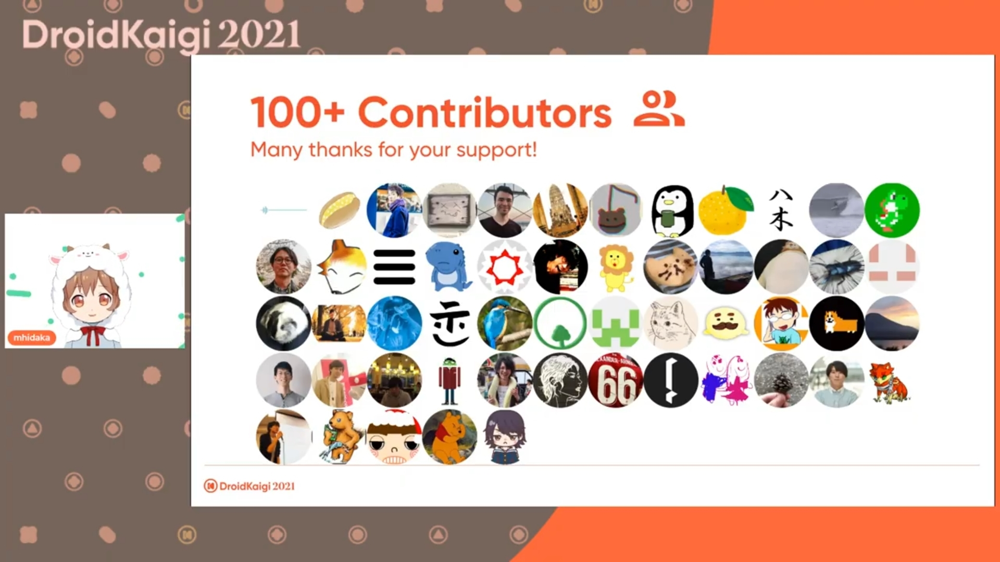

[DroidKaigi 2021](https://droidkaigi.jp/2021/)に参加したので忘れないうちに書いておこうと思います。
業務では Android を主に書いていて、メインでガッツリ触っている技術のカンファレンスに参加するのは初めてになります。

# DroidKaigi 2021とは

> DroidKaigiはエンジニアが主役のAndroidカンファレンスです。 Android技術情報の共有とコミュニケーションを目的に、2021年10月19日(火)、20日(水)、21日(木)の3日間開催します。
> 
> 参照：[DroidKaigi 2021](https://droidkaigi.jp/2021/)

# 特に自分に刺さったセッション

- [タイムテーブル](https://droidkaigi.jp/2021/timetable)
- [DroidKaigi 2021 - YouTube](https://www.youtube.com/playlist?list=PLaOdaBFokChwyYpRl3jkqjCC4I6Jmb5Jg) (全セッション動画のプレイリスト)
- [DroidKaigi2021セッション資料まとめ - Qiita](https://qiita.com/yuukiw00w/items/85891d818d42df119355)

平日開催なので仕事しながら聴いていました。裏で流していたので、基本的にどのセッションも音は聴いています。
どれも面白かったですが、その中でも特に興味を持って聴いていたセッションを感想とともに書いておこうと思います。

## プロダクトレベルで必要になる Jetpack Compose テクニック

- [https://droidkaigi.jp/2021/timetable/276801?day=1](https://droidkaigi.jp/2021/timetable/276801?day=1)
- [https://youtu.be/_5vP-NIRUCM](https://youtu.be/_5vP-NIRUCM)

今まさに Jetpack Compose を利用したアプリを作ろう！となっているので、画面遷移関連や便利ライブラリ等は特に今欲しかったものだ！！となりました。というか発表内容の殆どが今欲しいものなのでは？という感じ。

ちょっと色が透明になったりタップを裏が拾ったりの罠？っぽい **公式に(あまり)書いていない Tips** は、知っていただけで実装時のハマりを減らせそうな感じで嬉しい情報でした。

ちなみに [DroidKaigi/conference-app-2021](https://github.com/DroidKaigi/conference-app-2021) を触っていて気になった挙動が、発表に出てきた「下にある要素がタップを拾わないようにしたい」にそっくりな事象だったので、直すか！と少しコードを触りました。
`BackdropScaffold` っていうのを使っていて、うまいことぱっと解決はできなかった。撃沈。(なので [conference-app-2021#743](https://github.com/DroidKaigi/conference-app-2021/issues/743) を立てた)

## Androidエンジニアが1人という不安と向き合う

- [https://droidkaigi.jp/2021/timetable/277386?day=1](https://droidkaigi.jp/2021/timetable/277386?day=1)
- [https://youtu.be/5M0xJLdAcAE](https://youtu.be/5M0xJLdAcAE)

自分は2019年入社後2021年現在までチームで Android エンジニアが1人という環境にいます。業務も3年目になって不安を感じている真っ最中なので、これは絶対に聴こうと思っていました。
スライドに書いてある「これまでに抱えてきた不安」は自分も本当にそう感じていて、うわ〜〜〜やっぱそれ悩むよね〜〜〜っていう感じでなんか面白かった。

> 優れたソースコードを読む

これは自分も実践することがありますが、OSS のものを読んでいてもふわ〜ってしてしまってイマイチ身が入らないなぁと思っていることが結構ありました。
読むときのコツであげられている「読む目的を決める・スコープを絞って読む」はあまりやったことがなかったので今度やってみようかなと思います。
また、自分はコードから背景・意図を感じる(想像する)力が足りてないなと思うことが多々あるので、そこも意識的にやってみてもいいかなぁと考えてます。

> アーキテクチャに唯一の解はない

分かってはいるけど、どうしてもそこら辺を考えると無限に悩んでしまう自分がいて、この作り方して負債になってないかな・・・とかはよく不安になりますね。自分もアーキテクチャの正しさに悩まされすぎないようになりたいなぁ。

> 1人という不安については、ある種チャンス

最近はそこそこチャンスとして考えることができていて、自分にとっては挑戦的な技術選定とかをすることができているかも？
ただ、自己満足にだけはならないように気をつけないといけないな〜と思っています。

キャリアに関しては、自分がやりたいことが見えていないっていうのがぴったり当てはまっていると思いました。そこは一度しっかり考えないといけないなと思います。

自分にターゲットされているかのようなセッションで、聴けてめちゃ良かったです。

## ★2.2のアプリがIn-App Review APIを導入して★4.2になるまで

- [https://droidkaigi.jp/2021/timetable/277349?day=2](https://droidkaigi.jp/2021/timetable/277349?day=2)
- [https://youtu.be/PvAw4jNQc10](https://youtu.be/PvAw4jNQc10)

現在業務でストアレビューを良くしようタスクに着手している最中で、過去に[In-App Review APIでAndroidアプリレビューがめちゃくちゃ改善した話｜neuet / チャリチャリ｜note](https://note.com/neuet/n/n7b6d1f340606)を読んでいたので、より詳しく聴きたいなと思っていました。

> レビューのしやすさは満足度と評価のギャップを埋める。
> それは満足度が上がるということではない。
> サービスの満足度とのギャップがあるかわからない場合はまず調査をして、サービス満足度が低いのであればサービスの品質改善が先。

「わかる〜〜〜〜〜」っていうのと、「あ、そうだよね・・・」っていうのが同時にくる😇
実は既に `In-App Review API` は使っていて、いまいちレビュー評価が上がらない状況でした。
正直満足度に関しては不明なところが多いなと思っているので、この動画を一回チームに共有してみんなで考えてみようと思います。

`In-App Review API` がいいよ！みんなとりあえず使っておくべき！みたいな感じではなく、しっかりと状況を分析した上で導き出した施策の一つが `In-App Review API` でしたという話で、 `In-App Review API` を 使う/使わない/使っている/使っていない に関わらずとてもいい話でした。

## 触って学ぶAccessibility

- [https://droidkaigi.jp/2021/timetable/276229?day=2](https://droidkaigi.jp/2021/timetable/276229?day=2)
- [https://youtu.be/Rch-Uqk8MkA](https://youtu.be/Rch-Uqk8MkA)

お恥ずかしながら、自分は Accessibility を考えて実装したことが殆どありませんでした。存在は知っています。
実際にやるべきこととかは特に分かっておらず、そもそもどういった方法で操作をしているのかもあまり知りませんでした。
実際に触ってみて「こうなってるのか〜」とか、「自分も入力は音声入力を使うと思い込んでたなぁ」ってなりました。ほんの少ししか触ってないので、今度自分が触っているアプリもやってみようと思います。
スキャンアプリに関してはスキャンかけてみたら結構提案が出てきたので、少しずつ対応していこうかなってなりました。

実際の体験から入門することができてわかりやすくてよかったです。

## 2021年こそアクセシビリティと向き合おう

- [https://droidkaigi.jp/2021/timetable/276232?day=3](https://droidkaigi.jp/2021/timetable/276232?day=3)
- 動画はまだないっぽい（完全版もまだ）

ボタンを正確に押せない・複雑な操作が難しいとかの視点は持てていなく、想像することもできていなかったです。今までだと、押せるか押せないか、見えるか見えないかくらいしか想像できていなく、ハッとしました。
また、「うるさい場所では何も聞こえない」や「その言語が堪能ではないのでトーストが消えるまでに読めない」等の状況的障害は、たしかに。と思いました。
聴けたのは最初のところだけで実装のところはしっかり聞けなかったので、後日しっかり聴こうと思います。最初動画を60分で作っていたらしく？て完全版が出るらしいので楽しみ。

## いかにしてアプリの起動時間を改善するか

- [https://droidkaigi.jp/2021/timetable/272862?day=3](https://droidkaigi.jp/2021/timetable/272862?day=3)
- [https://youtu.be/8z0fKUcC110](https://youtu.be/8z0fKUcC110)

今までパフォーマンスを特に意識した改善とかをやったことがなかったので、実際どういうふうにやっていくんだろうというのは興味がありました。

> 直感で決めてはいけない、計測より始めよ

- ボトルネックを解消しないと意味がない
- 修正コストと得られる効果を考えて、作業の優先順位を決めるべき
- そもそも、認識していないボトルネックが存在するかもしれない

確かに〜。
実際に計測する方法もいくつかあげられていて、めちゃくちゃ参考になりました。

> XXXにアクセスすればみれるよ、は大体誰も見ない

それな！これは大体のことに言えそう。
運用・監視に関してはパフォーマンス以外のことにも適用できそうみたいなことが多くて為になりました。

## その他もろもろ

[Inside Jetpack Compose](https://droidkaigi.jp/2021/timetable/277384?day=3)とか[原理から完全理解するDagger Hilt Migration](https://droidkaigi.jp/2021/timetable/275396?day=3)とかは面白そうだなってなっていましたが、ながら聴きでは自分に難しかった・・・後でゆっくり聴きなおそうかなと思います。
英語のセッションに関しても基本的にﾜｶﾗﾝなので、これもまたゆっくり。

考えてみれば印象に強く残っているのは、実際に自分が求めているものだったり近い業務に関係しそうなことばっかりだった。それはそう。

ただ、全く触ったことない分野？（[Jetpack ComposeとGraphQLによるServer Driven UI](https://droidkaigi.jp/2021/timetable/277015?day=3)とか[Android Emoji 2021](https://droidkaigi.jp/2021/timetable/277220?day=2)、[動かす](https://droidkaigi.jp/2021/timetable/277266?day=1)とか）をおもしろ〜いと深く考えることなく聴くのもやっぱり面白かった。
[動かす](https://droidkaigi.jp/2021/timetable/277266?day=1)とかは発表資料がそもそも Android アプリだったりして、うお〜〜〜おもしろ〜〜いってなりました。
(動かすの発表資料リポジトリ -> [yaraki/AnimateIt](https://github.com/yaraki/AnimateIt))

# セッションの内容以外の話

## ノベルティ

まずノベルティ。Tシャツは結構しっかりした生地で、普段使いにも全く困らなさそうなものでした。自分はトークの募集に応募していないので扇子はもらっていませんが、めちゃくちゃ**センス**がいいと思いました！！ピンバッジかわいい。
スポンサーさんの選んだものも色々入っていて楽しいです。
他カンファレンスでもスポンサーをしている企業も結構いてびっくりしました。
カンファレンスのスポンサーをする等の技術コミュニティへの支援・貢献をしているのは素直にすごいな〜えらいな〜と思います。(偉そう)

## 運営

セッションのオフィスアワーに関しての質問を拾うのも人力でコメントや Twitter から拾っているのも大変だ〜ありがとうございます :pray: と思いますし、そもそもそれら含めた進行がすごい。MC （っていうんですかね？）も皆さん上手くてすごかったです。

また、マイクをスタッフの人やスピーカーの人に渡したりして、音質にも気を配ってくださっていたみたい。すごい。確かに音質の問題を感じることはあまりなかったように思いますね。

最終日のうちにアーカイブが殆ど上がるのも嬉しい。その他自分の気が付かない範囲でも色々動いていたんだと思っています。ありがとうございます 🙏

## 行動規範

DroidKaigi に関しては行動規範の周知や遵守を徹底しているような感じがしていて、その内容も自分はすごく納得できるのでめちゃくちゃ良いと思いました。
[一般社団法人DroidKaigi › 行動規範](https://association.droidkaigi.jp/code-of-conduct.html)
内容はすごく納得できているので、自分も気をつけながらこの行動規範を遵守していければなと思います。DroidKaigi の場以外においても。

# DroidKaigi公式フィードアプリ

セッションの [DroidKaigiカンファレンスアプリの歴史からみるアプリアーキテクチャのこれまでとこれから](https://droidkaigi.jp/2021/timetable/277194?day=2) をみてもわかる通り、2016年からアプリが存在しています。（OSS 化したのは2017年〜らしい）

今回自分は [DroidKaigi/conference-app-2021](https://github.com/DroidKaigi/conference-app-2021) に Contribute しました！

> いた！ [#DroidKaigi](https://twitter.com/hashtag/DroidKaigi?src=hash&amp;ref_src=twsrc%5Etfw) &mdash; [ぽん (@pon_dev)](https://twitter.com/pon_dev/status/1450264713787371521?ref_src=twsrc%5Etfw)October 19, 2021
> 

[DroidKaigi/conference-app-2020](https://github.com/DroidKaigi/conference-app-2020) を何回も参考にしたので、ちょっとした変更ではありますがとても感慨深いです。
自分がメインでキャリアを積んでいる技術の界隈に、このような場や機会が存在することはとても幸せだなと思いました。

今回はカンファレンスのためだけのアプリじゃなく、ためになる情報とかも載ってるっぽい（今後載るっぽい）です。すごい！うれしい〜。
(アプリの Google Play リンク → [DroidKaigi公式フィードアプリ](https://play.google.com/store/apps/details?id=io.github.droidkaigi.feeder))

# 終わりに

カンファレンスは何回か参加したことがありますが、全部そのときにはメインで触っていないこと（もしくはほぼ何もわからない）の状態の時しかなく、セッションを聴いてもへ〜〜〜くらいにしか思うことができませんでした。
今回は初めてメインでそれなりに触っている技術のカンファレンスに参加して、それらとはまた別の種類の面白さも感じることができました。
分かった上で聴いて考えるのも楽しいですね。

とても楽しかったです。次回またあれば参加したいですね。
関係者の皆様ありがとうございました〜！ :clap: :clap: