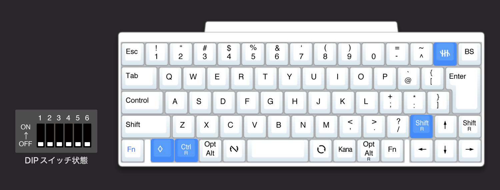

[HHKB(JIS)をWindowsとMacの両方でいい感じに使う](/posts/hhkb-jis-win-mac) のおまけに書いてある通り今は HHKB の JIS 配列のものを US 配列として使っていますが、ある程度こなれてきてそのまま行こうかなとなったので書いておきます。

前提条件として、背面スイッチは全てオフの状態で使っています。  
<https://happyhackingkb.com/jp/products/discontinued/hhkb_backview.html>

## HHKB のキーマップ変更

HHKB は公式でキーマップ変更ツールが用意されているので、それを使って設定します。  
<https://happyhackingkb.com/jp/download/>

JIS 配列の HHKB ではそのままだと US 配列にしても反応しないキーがあり使えなかったりするので、それを変更します。

↓

Ctrl R と Cmd に関しては [HHKB(JIS)をWindowsとMacの両方でいい感じに使う](/posts/hhkb-jis-win-mac) で設定した通りで変更ありません。こちらは Windows で使わないのであれば気にしなくて良いと思います。

さて、重要なのは右上の `¥` と `|` のキーです。これは US 配列としてそのまま使うと何も反応しません。なので、US で同じ位置にある `` ` `` と `~` を使うために変更します。（本来は BS の位置にありますが、エンターキー周りの配列の影響で一つ左の位置で入力できるようにします。）  
JIS でいうところの特殊ロゴ（記号）キーを設定すると、US 配列では `` ` `` と `~` になります。  
ちなみに、特殊ロゴキーは [公式ヘルプ](https://faq.pfu.jp/faq/show/2643?site_domain=hhkb) によると Windows は 半角/全角、macOS は Caps らしいです。使ってなかったので知らなかった。  

↑ の左にある Shift R に関しては余っていたので適当に置いています。矢印キーも US にはないのでここら辺も US そのまんまとは少し違いますね。本来の Shift R を Fn にして〜等をすると US に近づくかもしれないですが、今まで JIS で使っていた自分には違和感がすごいのでここは変更していません。

## Windows での設定

Windows で HHKB(JIS) を US として繋ぐと無変換キーと変換キーの位置のキーが反応しないため、それを使えるように設定します。

まずはキーボードレイアウトを US にするのを忘れずに。設定 > 時刻と言語 > 言語と地域 > 日本語の言語のオプション でキーボードのレイアウトを「英語キーボード (101/102 キー)」に変更します。

次は [PowerToys](https://learn.microsoft.com/ja-jp/windows/powertoys/) を使って反応しないキーを使えるように設定します。[PowerToys](https://learn.microsoft.com/ja-jp/windows/powertoys/) は Microsoft 公式の色々設定できるくんで、その中に Keyboad Manager があるのでそれで設定します。

変更内容は以下の通りです。

- VK 235 -> IME Off
- Undefined -> IME On

[PowerToys](https://learn.microsoft.com/ja-jp/windows/powertoys/) では割り当て変更の対象キーを押すことによって変更元を判定できるため、変更元の名前は特に気にしなくても大丈夫です。（Undefined とかなってるけどしっかり反応します）  
あと、自分は IME On/Off が好きなのでそうしていますが、お好みで Windows デフォルトの無変換と変換に割り当ててもいいと思います。

## macOS での設定

MacBook についているキーボードも JIS のものを使っていて、HHKB と同じ感じにしたいなーということで Karabiner-Elements を使って **MacBook についているキーボード** の設定を一部変更しています。

まず、Virtual Keyboard で JIS から ANSI に変更しないと JIS として認識されてしまう問題があったので、これを変更しています。

そして、HHKB のキーマップ変更と同様 JIS の `¥` と `|` の場所が使えないので MacBook のキーボードでもそれが使えるように設定します。

- international3 -> grave_accent_and_tilde(`)

HHKB の方は [HHKB(JIS)をWindowsとMacの両方でいい感じに使う](/posts/hhkb-jis-win-mac) で設定した内容と同じなので気にしなくて大丈夫です。

## おわり

これで HHKB の JIS 配列を使っている人がそのままそれを US 配列として使っても違和感なく使える設定ができました。Linux にそのまま繋いでも問題なく使えるかは分からないです。もし試してみたい人は試してみてください。
