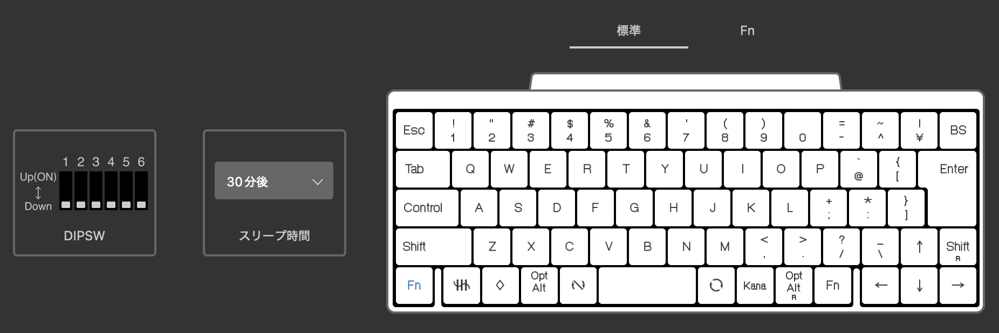
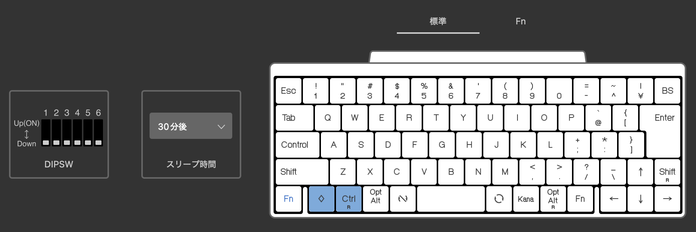
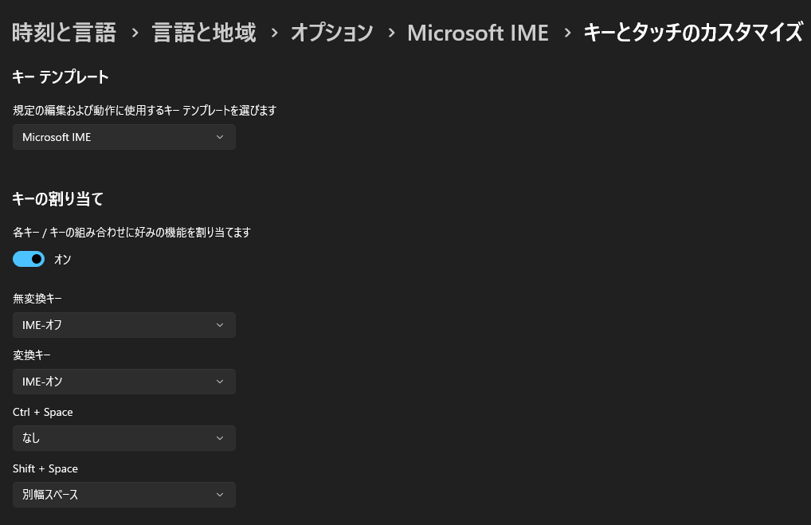
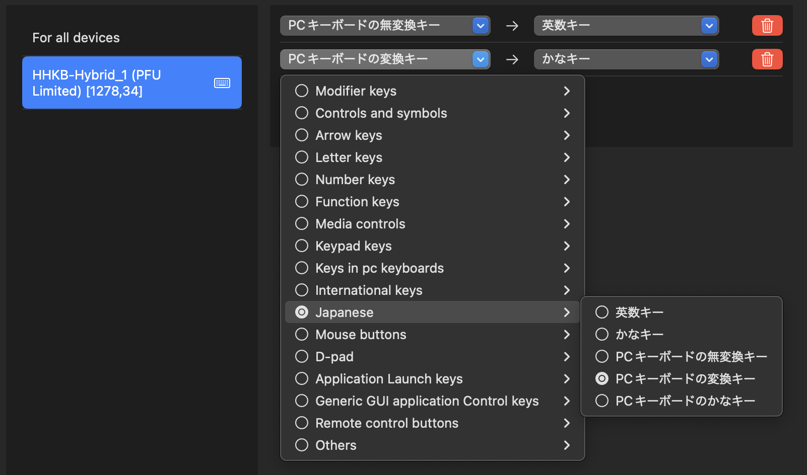

普段 HHKB HYBRID の JIS 配列を使っていますが、macOS と Windows を同じデバイスで切り替えて使っていると、いくつか問題とは言えなくとも違和感を感じることがあります。

前提条件として、背面スイッチは全てオフの状態で使っています。  
<https://happyhackingkb.com/jp/products/discontinued/hhkb_backview.html>

- Windows の Ctrl 関連のショートカットは macOS では Cmd になる。
  - ついでに macOS の Cmd は Windows では Win キーになる。
- スペースの両横にあるキーは Windows では無変換と変換だが、macOS だとそもそも使えない。（Windows モードの場合）

これらは問題とは言えませんが、頻繁に切り替えて使っているとそれなりにストレスになります。また、Windows モードと Macintosh モードをキーで切り替えることも可能ですが、変更したかどうかに脳のリソースを持っていかれるため避けたいです。  
そこで、それらをいい感じに解消できる設定をしばらく使っていたので、その設定を備忘録として残しておきます。

## HHKB のキーマップ変更

HHKB は公式でキーマップ変更ツールが用意されているので、それを使って設定します。  
<https://happyhackingkb.com/jp/download/>

Windows と macOS で Ctrl と Cmd がいい感じに対応するように設定します。  
macOS でいつもの位置で Cmd を使え、Windows でも macOS と同じ位置で Ctrl を使えるようにしたいです。そこで、Cmd を一つ左にずらして、元の Cmd の位置に右側の Ctrl を割り当てます。この際 Windows での 半角/全角 キーは捨てます。

↓

この変更をして、macOS 側では Ctrl R を Cmd に割り当てることにします。なぜ Ctrl R なのかというのは macOS での設定で説明します。

## Windows での設定 （お好み）

無変換・変換キーの位置は macOS ではかな・英数キーになっていて、macOS では変換ボタンの役割はなく IME のオンオフなので、Windows もそれに合わせます。

設定 > 時刻と言語 > 言語と地域 > オプション > Microsoft IME > キータッチのカスタマイズ でキーの割り当てを変更します。

- 無変換キー -> IME-オフ
- 変換キー -> IME-オン

## macOS での設定

このままではかな・英数キーが使えないため、Karabiner-Elements を使って設定します。  
<https://karabiner-elements.pqrs.org/>

まず、かな英数キーを使えるように設定します。  

- PC キーボードの無変換キー -> 英数キー
- PC キーボードの変換キー -> かなキー

次に、Ctrl R を Cmd に割り当てます。この際 Control を設定してしまうと左側の Control キーも使えなくなってしまうため、右側の Control キー（Ctrl R）を割り当てることで回避しています。

そして、最終的にはこうなります。

これで、HHKB を Windows と macOS で切り替えてもそのまま使えるように設定できました。一般的な Windows で使う JIS 配列のキーボードとは少しだけ違いますが、HHKB としてはどちらでもほぼそのまま使えると思います。

## おまけ

実は今は HHKB の JIS 配列のものを US 配列として使ってみています。（だから忘れないうちにこの記事を書いた）  
これは色々試してみている段階で、慣れてきて使っていこうとなったらまた設定を残しておこうと思います。
