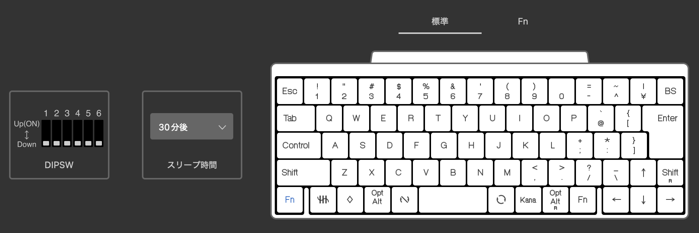
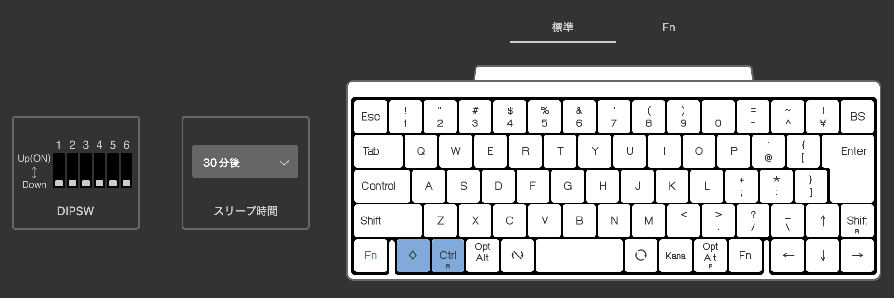
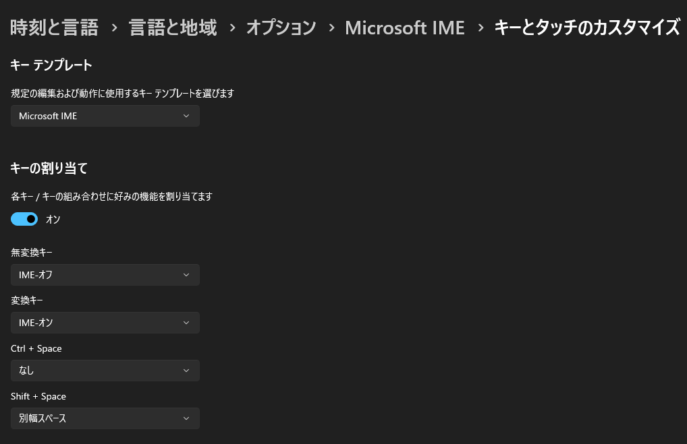
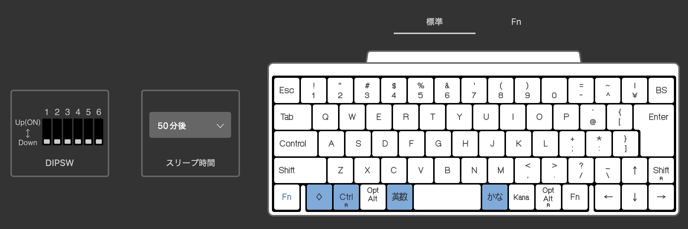
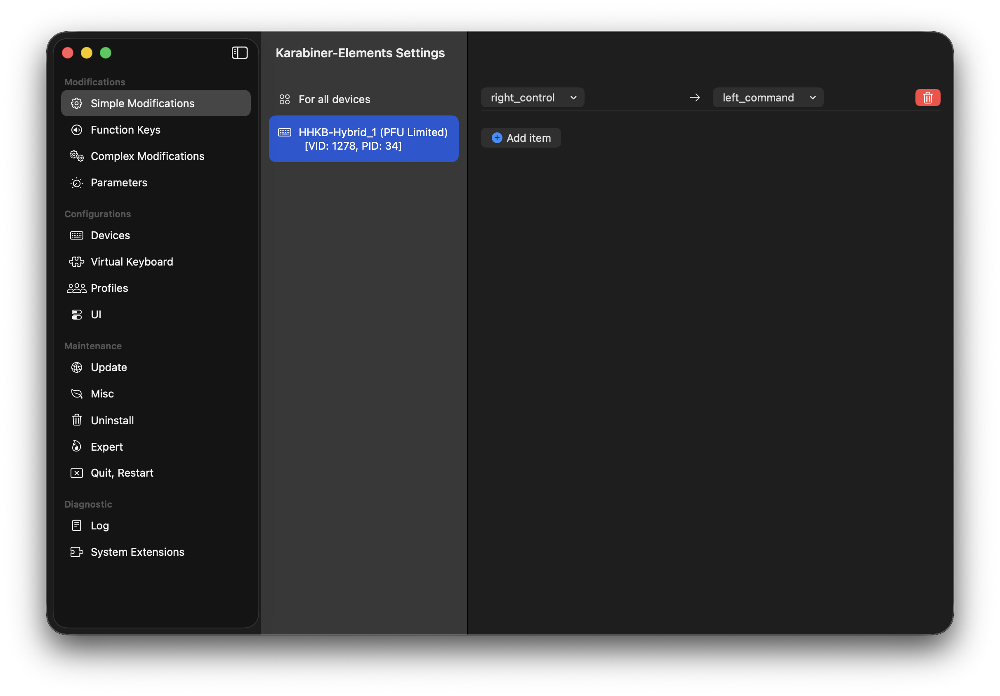

※2026/03/05 追記：設定を少し見直しました。

普段 HHKB HYBRID の JIS 配列を使っていますが、macOS と Windows を同じデバイスで切り替えて使っていると、いくつか問題とは言えなくとも違和感を感じることがあります。

前提条件として、背面スイッチは全てオフの状態で使っています。  
<https://happyhackingkb.com/jp/products/discontinued/hhkb_backview.html>

- Windows の Ctrl 関連のショートカットは macOS では Cmd になりがち。
    - ついでに macOS の Cmd は Windows では Win キーになる。
- スペースの両横にあるキーは Windows では「無変換」「変換」だが、macOS だとそもそも使えない。（Windows モードの場合）

これらは問題とは言えませんが、頻繁に切り替えて使っているとそれなりにストレスになります。また、Windows モードと Macintosh モードをキーで切り替えることも可能ですが、変更したかどうかに脳のリソースを持っていかれるため避けたいです。  
そこで、それらをいい感じに解消できる設定をしばらく使っていたので、その設定を備忘録として残しておきます。

## HHKB のキーマップ変更

HHKB は公式でキーマップ変更ツールが用意されているので、それを使って設定します。  
<https://happyhackingkb.com/jp/download/>

Windows と macOS で Ctrl と Cmd がいい感じに対応するように設定します。  
macOS でいつもの位置で Cmd を使え、Windows でも macOS と同じ位置で Ctrl を使えるようにしたいです。そこで、Cmd を一つ左にずらして、元の Cmd の位置に右側の Ctrl を割り当てます。この際 Windows での 半角/全角 キーは捨てます。

↓

この変更をして、macOS 側では Ctrl R を Cmd に割り当てることにします。なぜ Ctrl R なのかというのは macOS での設定で説明します。

## Windows での設定 （お好み）

「無変換」「変換」は macOS では「英数」「かな」になっていて、macOS では変換ボタンの役割はなく IME のオン/オフなので、Windows もそれに合わせます。

設定 > 時刻と言語 > 言語と地域 > 日本語の言語のオプション > Microsoft IME のキーボードオプション > キータッチのカスタマイズ でキーの割り当てを変更します。

- 無変換キー -> IME-オフ
- 変換キー -> IME-オン

ちなみに、Windows にこの設定を入れるのであれば、そもそも「英数」「かな」と設定するのでもいいですね。

## macOS での設定

Ctrl R を Cmd に割り当てます。この際 Control を設定してしまうと左側の Control キーも使えなくなってしまうため、右側の Control キー（Ctrl R）を割り当てたに使ったというわけですね。

これで、HHKB を Windows と macOS で都度設定の変更なくそのまま使えるように設定できました。一般的な Windows で使う JIS 配列のキーボードとは少しだけ違いますが、HHKB としてはどちらでもほぼそのまま使えると思います。

## おまけ

実は今は HHKB の JIS 配列のものを US 配列として使っています。おすすめです。  
[HHKBのJIS配列をUS配列としていい感じに使う](/posts/hhkb-jis-us)
