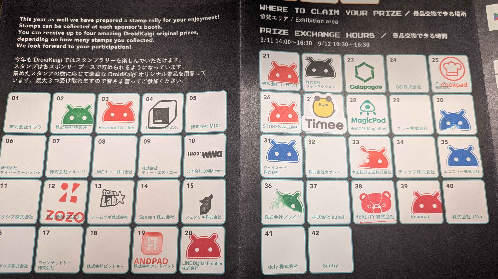

[DroidKaigi 2025](https://2025.droidkaigi.jp) に参加したので忘れないうちに書いておこうと思います。こういったのを書くのは久しぶりで、いつも書こうと思っていると月日が経ってまあいいか・・・になってしまうループを過ごしていましたが、今回は書くに至ります。  
なんで書こうと思ったのかというと、DroidKaigi 2025 では書くとピンバッジをもらえるらしいからなんですね。ピンバッジ欲しい。  
~~ということで、もしこれを見た方で参加してまだ書いてない方いたらピンバッジもらえるので書きましょう。~~  
※ 公開前だけど追記 なんかダラダラと書いてたらフォームが締め切られてしまったようです。残念。本当は20日くらいに出す予定だった。

https://twitter.com/DroidKaigi/status/1968147905375506632

（ちなみにこのために今回 Twitter の埋め込み表示を実装しました）

## DroidKaigi 2025とは

> DroidKaigiはエンジニアが主役の Androidカンファレンスです
> Android技術情報の共有とコミュニケーションを目的に 2025年9月10日(水)〜12日(金)の3日間開催します。
>
> 参照：[DroidKaigi 2025](https://2025.droidkaigi.jp)

## 1日目（Workshop Day）

1日目はワークショップの日でした。去年も参加したのですが、去年よりもパワーアップしているように思いました。プラットフォームの状況も変わっていそうだったので、登場人物もちょいちょい変わってました。Compose Hot Reload とか Room とか。
去年やったのもありワークショップ中に出た課題みたいなのは一通りすんなり実装できました。時間的に後半の課題はスキップして説明だけしていたので、後でスライド見てやってみようかなと思います。（資料は載せていいのかよくわかんないので載せません）

### 1日目おまけ

ワークショップ後にお祭りがありました。外で射的輪投げがあって、お酒をもらって立ち飲みしながら話したりしました。

https://twitter.com/pon_dev/status/1965796398030537115

知り合い一人、同じテーブルだった方一人、その時知り合った方一人とだいぶ話して、2次会行って23時くらいまで飲みました。こういうのもあるんだな〜と思って楽しかったです。写真撮っておけばよかった！って次の日の懇親会で言われて、確かに・・・と思いました。思い出は記憶の中に・・・  
同じ職種の飲み会はやっぱり話が弾んで良いですね！

## 2,3日目（Conference Day）

いつもは適当に起きた時間に行って、休憩多めながらセッションを聴くことで殆どの時間を過ごしていました。今回は頑張っていきましょう的な感じになったので頑張って朝早くに起きていきました。  
あと企業ブースにも今回は結構いきました。（前年比）

### セッション

- [タイムテーブル](https://2025.droidkaigi.jp/timetable)
- [DroidKaigi 2025 - YouTube](https://www.youtube.com/playlist?list=PLaOdaBFokChxaOXJWpabH4s9t7cqTCHc_) (全セッション動画のプレイリスト)

今回は聴きに行ったセッションで印象に残ったものをざっと書いておきます。といいつつちょっと前で全然忘れたので、動画だけ貼っときます。あとで見返す用。

#### 聴いたやつで後で見返したいなと思ったもの

##### [Androidライブラリアンの手引き：堅牢なライブラリとSDKの構築](https://2025.droidkaigi.jp/timetable/946618/)

https://www.youtube.com/watch?v=0K_X4uNbU8U

##### [例外のその先へ：セーフティクリティカル原則に基づき堅牢なAndroidアプリを構築する](https://2025.droidkaigi.jp/timetable/939376/)

https://www.youtube.com/watch?v=c-OO-8diTpk

##### [Androidは裏でどのようにデータ構造を活用しているのか](https://2025.droidkaigi.jp/timetable/946631/)

https://www.youtube.com/watch?v=6Y8ir1WE-UU

##### [スマホ新法って何？１２月施行？アプリビジネスに影響あるの？](https://2025.droidkaigi.jp/timetable/981378/)

https://www.youtube.com/watch?v=GxMjoQ_pIr4

##### [Cache Me If You Can](https://2025.droidkaigi.jp/timetable/946751/)

https://www.youtube.com/watch?v=bcmK90SRN-0

#### 現地で聴いてないけど見返したいなと思ったやつ

##### [プロパティベーステストによるUIテスト: LLMによるプロパティ定義生成でエッジケースを捉える](https://2025.droidkaigi.jp/timetable/945988/)

https://www.youtube.com/watch?v=ur-w06-L6SU

##### [Androidエンジニアとしてのキャリア](https://2025.droidkaigi.jp/timetable/946868/)

https://www.youtube.com/watch?v=vsRFa1xHqL4

##### [基礎から学ぶ大画面対応 〜「Large screen differentiated」認定アプリの開発知見〜](https://2025.droidkaigi.jp/timetable/944124/)

https://www.youtube.com/watch?v=pNyNUnLfNzA

##### [意外と知らない Android と Google Play の世界](https://2025.droidkaigi.jp/timetable/995003/)

これは動画ないらしい・・・残念。忘れ物を何回か取りに帰ったら遅刻して行けませんでした。

##### [Navigation 2 を 3 に移行する（予定）ためにやったこと](https://2025.droidkaigi.jp/timetable/946771/)

https://www.youtube.com/watch?v=BKn875Qr9io

##### [Deep dive into Kotlin Flow](https://2025.droidkaigi.jp/timetable/928111/)

https://www.youtube.com/watch?v=qR-HecTPNaY

##### [OAuthを正しく実装する：Androidアプリのためのセキュアな認証](https://2025.droidkaigi.jp/timetable/932385/)

https://www.youtube.com/watch?v=jvLXj7Mzraw

##### [Be a Business-Driven Android Engineer](https://2025.droidkaigi.jp/timetable/946204/)

https://www.youtube.com/watch?v=1dD4HLTDkFc

### 企業ブース散策

結構行った（半分）なので終わってみるとあんまり行けてない気もしますが、行ったところの施策は全て体験してアンケート類も全て答えたので行った感はマシマシです。  
ノベルティが凝っているところ、体験型のアクティビティがあるところ、深く会話をしてくれるところ色々ありました。

全体的にしっかり話を聞いたりしてきたので大体印象に残っているんですが、特に印象に残っているのは本田技研工業株式会社さんのラジコン縦列駐車で、全然うまくいかなくてギリギリで時間オーバーしたのが悔しかったです。免許持ってないので仕方ない（言い訳）。その会社の色を出したアクティビティで面白く、すごいな〜と思いました。

株式会社ディー・エヌ・エーさんはアプリを1から作り上げることをやっていたらしくて、面白そうだな！と思いつつ行けなかったのが残念でした。どんなアプリが出来上がったのか気になます。ブログで後ほど公開されるらしいので楽しみにしています。

あとはエムスリー株式会社さんで「[デジスマ診療](https://digikar-smart.jp)」アプリを作ってるって聞いて、最近近くの病院が導入していて便利に使わせてもらっています！ありがとうございます！みたいな話をしたのもこういうイベントならではだなと思いました。面接時にそのアプリを作りたいというアピールをして入社した後に実際に作ったとかを話していた気がします。すごい。

## After Party

2日目の夜に懇親会がありました。朝早く起きたので眠くてあんま覚えていません・・・w  
Workshop Day の時に知り合った方と話したり、今の同僚や前職や前々職の元同僚たちと話したりしました。同窓会みたいな感じで楽しかったです。  
マグロ解体ショーとかもやってました。（後ろの方にいたのであんまり見えなかった）

## DroidKaigi公式アプリ

今年も公式アプリがありました。[DroidKaigi/conference-app-2025](https://github.com/DroidKaigi/conference-app-2025)  
こういうのがあるのはすごくありがたいですね。ということで今年も Contribute しました！

https://github.com/DroidKaigi/conference-app-2025/pulls?q=sort%3Aupdated-desc+is%3Apr+author%3APon57+is%3Amerged

今回は予め立てられていた issue から1つ、触ってみて個人的に改善できそうだなと思ったところをそのまま PR を作る形で2つの計3つの PR を作成し、レビューいただいたのちマージしていただきました。ありがとうございます！

## おわり

DroidKaigi 2025 に参加した話を書いておきました。後から見返しても思い出になるので、こういうのは書いておくと日記みたいで良いですね。  
ただ、今回の学びとして、最初にガーっと書いて出しちゃう方が良いなと思いました。8割くらい書いて放置していたら残り2割部分の全てを忘れて残り書けないし、期限切れでピンバッジも貰えませんでした 😿  
スタッフの皆様、登壇者の皆様、参加者の皆様、ありがとうございました！また来年も参加したいと思います。
