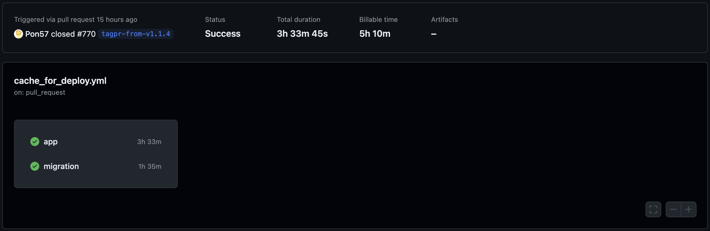
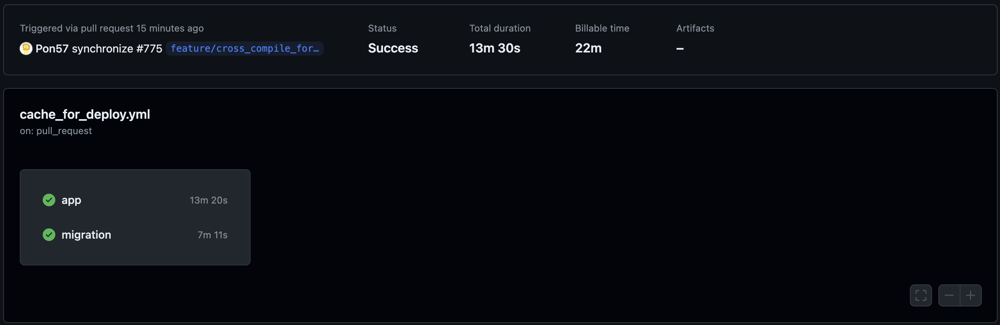

[WebサービスをRustでフルリプレイスした話](/posts/smashfreaks-replace-with-rust) を書きましたが、途中で ECS Task の cpu_architecture を X86_64 から ARM に変更しています。（なんか Graviton2 がちょっと安いしちょっと性能がいいらしい）  
その際に GitHub Actions 上でクロスコンパイルをする必要があったのですが、それでハマったのでメモしておきます。  
ちなみにこれが本当に正しいのかよくわかってないので、別の良い方法があるかもしれません。

## 前提

- この Rust プロジェクトは axum で作られた Web アプリケーションです。
- GitHub Actions 上でビルドされ、AWS ECS にデプロイされます。
- GitHub Actions では ubuntu-latest を使っていて、これは現状 x86_64 です。（[Accelerate your CI/CD with Arm-based hosted runners in GitHub Actions - The GitHub Blog](https://github.blog/changelog/2023-10-30-accelerate-your-ci-cd-with-arm-based-hosted-runners-in-github-actions/) によるともうすぐ使えるようになるかもしれない）
- 実行コンテナイメージは `gcr.io/distroless/cc-debian12` です。

## まず何をやったか

一番楽な方法をまず試します。  
`docker/build-push-action` を使って Docker イメージをビルドしているので、これに `platforms: linux/arm64` を追加してみました。すると・・・？



脅威の Billable time **5h 10m**！  

## 何が問題だったか

Docker のビルドで実行ホストと違うプラットフォーム用のコンテナのビルドには QEMU エミュレーションが使われるらしいのですが、これがどうも遅いらしいです。

## どう解決したか

Rust のクロスコンパイルを使うことにしました。しかし調べてすぐ出てくるような方法ではイマイチうまく解決できませんでした。最終的には色々なところからちょっとずつ拾ってきて試したところ動くようになりました。

```shell
apt-get install g++-aarch64-linux-gnu
CARGO_TARGET_AARCH64_UNKNOWN_LINUX_GNU_LINKER="aarch64-linux-gnu-gcc"
CC_aarch64_unknown_linux_gnu="aarch64-linux-gnu-gcc"
CXX_aarch64_unknown_linux_gnu="aarch64-linux-gnu-g++"
```

> <https://kerkour.com/rust-cross-compilation>

```shell
dpkg --add-architecture arm64
apt-get install libssl-dev:arm64
```

> <https://fltk-rs.github.io/fltk-book/Cross-Compiling.html#x64-linux-gnu-to-aarch64-linux-gnu>

```shell
PKG_CONFIG_SYSROOT_DIR="/usr/aarch64-linux-gnu/"
```

> <https://stackoverflow.com/questions/68871193/pkg-config-error-during-rust-cross-compilation>

これらを Dockerfile に追加してビルドしました。すると・・・？



Billable time **22m**！

## 結果

嬉しい（なんか変なところとかこうした方がいいみたいなのがあったらよければ教えてください）
