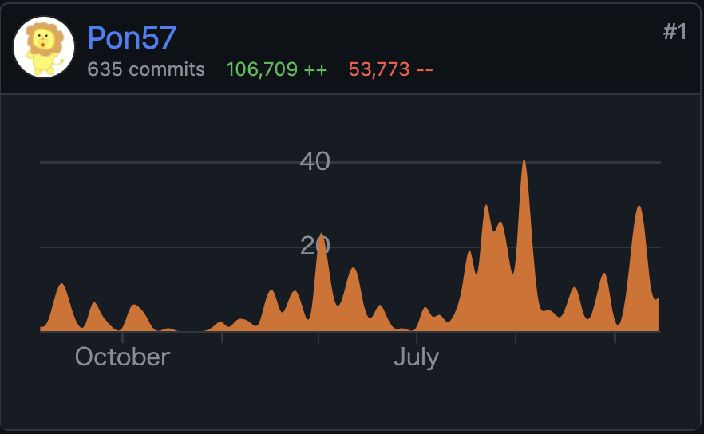

個人で作ってた Web サービスを Rust で作り直したので、熱が冷めないうちに覚えてることを備忘録的に書いておこうと思います。  
いくつか本のリンクを貼ってますが、全て Amazon のアソシエイトリンクなのでそこが気になる人は検索して買ってください。

## どんなサービス？

どんなサービスかを軽く説明しておきます。  
<https://smashfreaks.games>  
SmashFreaks というスマブラ界隈の主にオフラインイベントで使われているサービスです。イベントに参加しているユーザー同士が1対1でマッチングをし、対戦するモニターを自動で割り当てます。対戦後に結果報告をすることでレート計算が行われます。  
全てユーザーの操作に依存しているため、特別な管理作業以外の運営作業がほとんど発生せず、イベントスタッフも対戦に参加することができます。  
2019年7月にリリースされ、4年半くらいのサービスです。  
<https://smashlog.games/9818>

## なぜ作り直すのか

SmashFreaks は元々 PHP の [Laravel](https://laravel.com) 製で、当時新卒1年目の配属が決まった頃くらいに開発期間1ヶ月ほどでリリースしました。特に何も考えずに作っていたのでこの世の全てを Controller に書き、テストは存在せず、Eloquent のモデルを直接あれこれするみたいな感じでした。  
その後すぐ新型コロナのあれこれでオフラインイベントが無くなり殆ど使われなくなってドメイン代とサーバー代だけ払ってました。何回か途中でリファクタリングをしようとするもモチベ続かずに途中で止まるみたいなことをしてました。  
新型コロナが出始めてからしばらく経った後に、オフラインイベントが復活してきたあたりで使ってくれるところが徐々に増えてきました。サイトの出来に満足いってなかった自分は「これはなんとかしないといかん！」と触ろうとするんですが、「これこのコードの改善と作り直しの時間ほとんど変わらなさそうじゃね？」みたいな感じに思ったので作り直すことにしました。

## 作り直し時の判断

自分は Web サービスは PHP でしか作ったことがありませんでした。インフラもアルバイトで多少の構築経験を得られたくらいで、それまではレンタルサーバーにポン置きだったため、殆ど知識はありません。  
今回も PHP で作り直そうとしており、[BEAR.Sunday](https://bearsunday.github.io/manuals/1.0/ja/) を触ってみたりとかフロントに [Next.js](https://nextjs.org) を触ってみたりとかしたんですが、結局全然作りませんでした。（ログインぐらいは作ってみた）  
結果選択したのは Rust でした。Rust は触りたいなという興味があってほんの少し触っていたこと（フレンドに頼まれた Discord bot の作成とか）、[kenkoooo](https://twitter.com/kenkoooo)さんの発信等で Rust でも Web バックエンドいけるらしいという情報があったのでまあやってみるか〜と Rust を選びました。パフォーマンスがどーとかそういうのは選定理由に入ってません。規模が全然大きくない個人開発サービスですしね。
DB のデータだけ dump してきて、そこから作りながらマイグレーションを書いていくみたいな感じで進めることにしました。作り直して触れるようになる（触るモチベが出るようになる）のが目的ですが、明らかに気になるところや要望をもらっているところは新機能実装や修正をしました。

## 開発期間

リポジトリは作ったのが2022年7月でなので1年半くらい。途中全く触らなかったりとかもあり実際にもりもり書き始めたのが2023年の9月くらいなんで、稼働したのは半年くらい？  
なんかちょうど筆乗り始め時期に[iOSDC Japan 2022](https://iosdc.jp/2022/)と[2023](https://iosdc.jp/2023/)があって、両方とも会場で休憩時間にちょっと書いていた記憶がありますね。

## 構成

### インフラ

AWS を使っています。今まで自分は前述の通りレンタルサーバーにポン置きした PHP という構成で公開しかしてなかったです。流石にそろそろ他の方法触っておくか・・・みたいな気持ちもあり、今流行り（遅い）のクラウドや！ということで AWS を使ってみることにしました。

構成はよくある CloudFront -> ALB -> ECS Fargate -> RDS(MariaDB), ElastiCache(Redis) です。  

さらっと構成図を書いてみました。コンテナは public subnet においてます。ログインに外部サービスを使うためアウトバウンドが必要で、 NAT Gateway とか VPC Endpoint とかが高かったので、Security Group に頑張ってもらって・・・。  
これらは Terraform で定義ファイルを作り、apply でいつでも同じものが作れるようにしています。  

なんもわからんの状態で作ってみるのはこの本が役に立ちました。ちなみにこの本はスマブラのフレンドから教えてもらいました。

[Amazon Web Services基礎からのネットワーク＆サーバー構築改訂](https://amzn.to/3HYNEDW)

まずこの本を参考に手動で Web UI 上で構築してみて動くことを確認した後、[Terraform CLI の Import 機能](https://developer.hashicorp.com/terraform/cli/import) を使って1個1個 import してみて Terraform の構成ファイルに落とし込みました。

#### bastion

本番の RDS に繋ぎたくなった時のために bastion という ECS Service を作っています。実態は [amazon-ssm-agent/amazon-ssm-agent](https://gallery.ecr.aws/amazon-ssm-agent/amazon-ssm-agent) というイメージです。AWS CLI の Session Manager を使ってローカルの好きなポートにポートフォワードして RDS に繋げるようにしています。通常時は必要なタスクを0にして無駄な課金が発生しないようにしていて、必要な時だけタスクを立ち上げるようにしています。

### アプリケーション

Rust の [axum](https://github.com/tokio-rs/axum) というフレームワークを使っています。非同期ランタイムが〜とかパフォーマンスが〜とかはあんまよくわかんないですが、[tokio](https://tokio.rs) が作ってるのですぐ潰れることはないだろうみたいな安易な考えで採用しました。悪い話も聞かないし触っててもいい感じがするので良かったと思います。他にも [Actix](https://actix.rs) は本を読んで少し触ってみたりしました。  
読んだ本はこちら -> [実践Rustプログラミング入門](https://amzn.to/3SVdrTs)

Rust はランタイムエラーが少ないな〜というところが気に入っており、今回書いたコードでランタイムエラーが出る時は基本的に OAuth とかでレスポンスが意図していない時、DB 周りで変なコードを書いた時、DB 等に接続できなかった時くらいです。それ以外は意図したエラーでハンドリングできています。  
（ちなみに他の言語でも出ないように書けるとかはあると思いますが、特に意図していないけどそうなったところも気に入りポイントです。）

#### Askama

[djc/askama: Type-safe, compiled Jinja-like templates for Rust](https://github.com/djc/askama)

テンプレートエンジンには [Askama](https://github.com/djc/askama) を使っています。[Tera](https://github.com/Keats/tera) を最初使っていましたが、コンパイル時に問題が分からないのでそこが不満に感じてました。[Askama](https://github.com/djc/askama) はコンパイル時に問題がわかるので最高になりました。VSCode で書いているので拡張とかは無くて、若干どこで問題が発生しているのかが分からない時があります。まあエラーログを見れば大体わかりますが・・・パフォーマンスもなんかそこそこいいらしいです。[Tera](https://github.com/Keats/tera) はその都度外に置いてあるテンプレートファイルを読むみたいな感じ（多分）だったと思いますが、[Askama](https://github.com/djc/askama) は生成されるシングルバイナリに含まれるみたいな感じになります。

#### SeaORM

DB 周りには [SeaORM](https://www.sea-ql.org/SeaORM/) という ORM を使ってます。最初は [sqlx](https://github.com/jmoiron/sqlx) を使っていました。使ってみたかった理由はなんとなくですが（またか）、[sqlx](https://github.com/jmoiron/sqlx) はコンパイル時に SQL がおかしそうなことがわかる macro があったりしてちょっと羨ましさを感じます。ちょいちょいランタイムエラーで気がつくことがあります。どうするのがバランスいいんだろう・・・

#### tower-sessions

[maxcountryman/tower-sessions: 🥠 Sessions as a \`tower\` and \`axum\` middleware.](https://github.com/maxcountryman/tower-sessions)

セッション管理にはこの crate を使っています。同作者の [axum-login](https://github.com/maxcountryman/axum-login) という crate も便利そうだな〜と思いつつ、そっちは middleware を作ったりして自前でやってたので一旦は使ってません。試してみて良さそうだったら使ってみるかも。

#### OAuth2

[ramosbugs/oauth2-rs: Extensible, strongly-typed Rust OAuth2 client library](https://github.com/ramosbugs/oauth2-rs)

アカウント認証周りにはこの crate を使っています。OAuth2 に対応しているサービスであれば簡単に使えたのでよかったです。

### 開発環境

開発環境用の Dockerfile を書いて DevContainer を使って VSCode で開発しています。

#### Mold

[rui314/mold: Mold: A Modern Linker 🦠](https://github.com/rui314/mold)

リンカーに [Mold](https://github.com/rui314/mold) というものを使っています。[cargo-watch](https://crates.io/crates/cargo-watch) を使って保存するたびにコンパイルが走るみたいな感じにしてるんですが、露骨にスピードアップを感じます。おすすめ。

#### OrbStack

Docker コンテナ環境は [OrbStack](https://orbstack.dev) というのを使っています。最初は [Docker Desktop](https://www.docker.com/products/docker-desktop/) を使っていて全然不満なかったんですが、[OrbStack](https://orbstack.dev) にしたら立ち上げがすごい早くなりました。コンパイル自体も多少速かったです。DevContainer は何もせずそのまま使えたので、同じような環境の方にはおすすめです。

### CI / CD

GitHub Actions でデプロイまで自動でやってます。使っているワークフローは以下。

- main
- pr
- tagpr
- cache_for_deploy
- deploy

それぞれについて書いていきます。

#### main

main ブランチにマージされた時に動きます。テストだけ動かしてます。  
[Swatinem/rust-cache](https://github.com/Swatinem/rust-cache) を使っています。

#### pr

Pull Request が作られた時や、コミットが更新された時に動きます。まず [dorny/paths-filter](https://github.com/dorny/paths-filter) を使ってファイルの変更をチェックし、Rust に関係するコードに変更がなければスキップします。  
test のほか、fmt や clippy を動かしています。[Swatinem/rust-cache](https://github.com/Swatinem/rust-cache) を使ってビルド & キャッシュした後、それを使って test, fmt, clippy が動くようにしています。  
fmt や clippy で何かあった時には Pull Request にコメントを書いてくれます。

#### tagpr

[Songmu/tagpr](https://github.com/Songmu/tagpr) を動かすワークフローです。main ブランチにマージされた時や、tagpr によって作られた Pull Request のラベルに変更があった時に動くようにしています。これは後から tagpr:minor とかをつけたくなった時用です。tagpr は動いた後に main ブランチに変更があれば自動で Pull Request が作られます。その Pull Request をマージするとタイトルのバージョンタグが切られ、そのタグの Release が publish されます。  
これめちゃくちゃ最高なのでおすすめです。自分は後述のワークフローと組み合わせてかなり満足度高いリリースフローが作れました。  semver の minor とかは現状は特に意味もないので気分で適当に決めてます。

#### cache_for_deploy

main ブランチに tagpr によって作られたブランチがマージされた時に動きます。デプロイのための Docker イメージをビルドします。main ブランチでキャッシュを作らないと読めない仕様があるみたいで、後述する deploy は Release が publish された時に動きます。Release の publish をトリガーとするワークフローでは確かキャッシュが共有できなかったため、ビルドのためのキャッシュは main ブランチに紐づいているここでやってます。  
Dockerfile 内では [cargo-chef](https://github.com/LukeMathWalker/cargo-chef) を使ってレイヤーキャッシュが効くようにしています。

#### deploy

tagpr によって Release が publish された時に動きます。（手動 publish でも動く）  
`cache_for_deploy` が終わってから動いて欲しいため、concurrency で `cache_for_deploy` と同じ group を設定しています。  
cancel-in-progress は false。`cache_for_deploy` が終わってからだとビルドにかかる時間は10秒以内なのでほぼ無しです。デプロイ時間だけ。  
ここでは二つデプロイしています。App 本体と、DB マイグレーションです。

軽い手順を話すと、App では

> イメージをビルドして ECR にプッシュ -> [aws-actions/amazon-ecs-render-task-definition](https://github.com/aws-actions/amazon-ecs-render-task-definition) でタスク定義を更新 -> [aws-actions/amazon-ecs-deploy-task-definition](https://github.com/aws-actions/amazon-ecs-deploy-task-definition) でタスク定義をデプロイ

DB マイグレーションは ECS のクラスターでタスクとして動かしているので

> イメージをビルドして ECR にプッシュ -> [aws-actions/amazon-ecs-render-task-definition](https://github.com/aws-actions/amazon-ecs-render-task-definition) でタスク定義を更新 -> `aws ecs run-task` コマンドでタスクを実行

という感じにしています。（こっちはもっといい方法ありそう？）

#### Renovate

バージョンアップには [Renovate](https://www.mend.io/renovate/) を使ってます。勝手に Pull Request を作ってくれるので便利です。開発環境用の Dockerfile では [Mold](https://github.com/rui314/mold) のコンパイルや [cargo-watch](https://crates.io/crates/cargo-watch) 等の install をしているんですが、それのバージョン更新だけ拾えなかったので `regexManagers` で拾えるように設定してます。

## リリース

まずはサブドメインを作ってその上でオフラインイベント運営の方に協力を得てテストイベントを開催しました。そこで特に問題なく動いてました。  
後はテストイベントを積み重ねるか、えいやでリリースするかで、めんどくさくなってえいやでリリース日を決めてリリースしましたw  
リリース日の後に使われる中では最大規模のイベントで使われることがわかっており、そこである程度バグは出るかな・・・みたいな。  
実際進行不能バグはなかったものの、マッチングロジックにおけるバグはいくつかあり、修正をデプロイしまくりました。進行不能バグはなかったので大成功でした。（元々のプログラムの方にも普通にバグはあったので）  
一応リリース後1週間ぐらいはそれなりに監視をしてバグがあったら直す生活をしました。

### 負荷の感じ

スペックよくわからないんで全て最低でリリースしてます。ECS Fargate の CPU は LINUX/ARM64 の 0.25vCPU、 メモリは 512MB です。RDS とか ElastiCache は t4g.micro です。  
負荷を見ていると、メモリ使用率は常に2%以下。CPU使用率も高い時で36%くらいでした。大丈夫そう。  
高い時というのは最大規模のイベントで使われた日で、サイト内での総参加者数が214人が1つ、29人が1つ、14人が1つの計3つのイベントで同じ時間に使われていました。  
戦っている人がいたり帰ってたり休憩してたりそもそもやってなかったりする人がいるので同時に214人+29人+14人が常に触っているわけでは全然ないんですが、それでも結構余裕な感じでしたね。一応オートスケールの設定は入れてました。

グラフではメモリが3%までいってるんですが、無駄なキャッシュをしていてほぼ意味ないところだったので後に消しています。消した後は2%以下安定してますね。（メモリの0になってるところはデプロイしているところで、5回くらいデプロイしたらしい。）

ちなみに PHP の時は1000円くらいのサーバーを借りてたんですが、ふと気になって過去の CPU 使用率を見てみたら高くても2%でした。 (2Core 1GB)  
メモリ使用率は6%までいってた時があったんで、メモリ使用量は明確に減ってそう。CPU 使用率は元々低いのでよくわからない。  

### Rust の感想

開発環境周りも含め書いていてかなり気持ちがいいです。clippy とかもかなり良い。ライフタイムや所有権とかはまだいまいち慣れてません。隙あらば `.clone()` とかは大分減ったと思いますが、それでもうーんこれは `.clone()`！w みたいなことはたまにします。  
そんな言語仕様にあまり詳しくない自分ぐらいの浅ちゃぷでも Web バックエンド作れるので、少しでも触ってみたい人がいたら触ってみてください。気持ちいいですよ！  
これから知識を付けていって、より Rust っぽいコードに変えていく作業が続いていくんだろうなと思うとそれも楽しそうです。  

あとはガッと書き換える時のやりやすさですね。最初はめちゃくちゃエラーが出てキツってなるんですが、1個1個直してるとなんか勝手に動くようになってて、しかも動くことが保証されているかのような安心感があります。（実際殆ど問題なく動く）

### これからの課題

テストがないんです・・・。（テストもなく〜とか言ってたのに結局ない）  
なのでテストをモリモリ書いていこうと思います。でもテストなくてもロジックのバグくらいしかなかったのが凄いなと思いました。（それをテストでry）  
まあ簡単な Web アプリですし CRUD が主なところもあると思いますが。  
という感じでテストを書いていくぞとなっています。

また、[SeaORM](https://www.sea-ql.org/SeaORM/) の Relation 周りがまだ使いこなせてなくて結構ぐっちゃぐちゃなので、それも良い感じにどうにかしたいです。

後はちゃんと Rust っぽいコードが書けるようになっていきたいですね。

## おわり

ということで Rust でフルリプレイスした話を書いてみました。パフォーマンスとかコストとかをあんま考えずにできるのが個人開発の良いところですね。ただ、どう考えても構成がオーバースペックで高いな〜〜みたいな感じには思ってるので、そのうちコストを下げるための何かを考えるかもしれません。  
個人開発は完全に自由なので最高ですね 🥳
