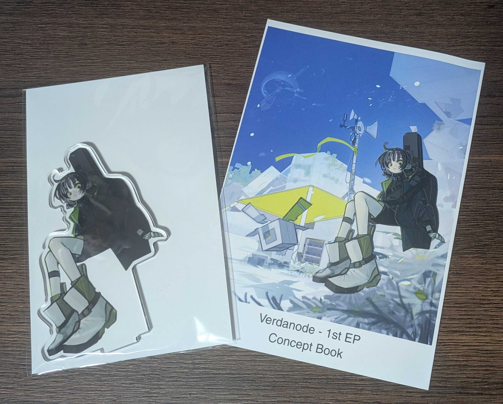
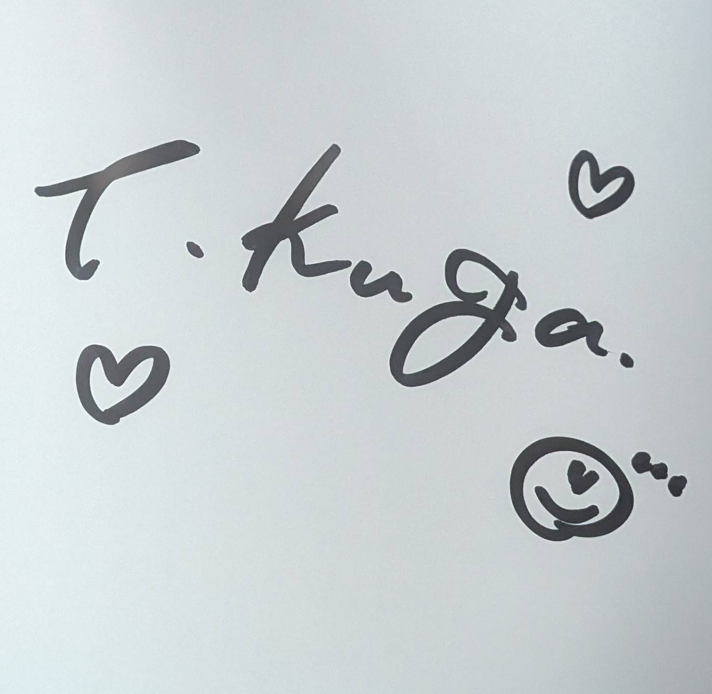
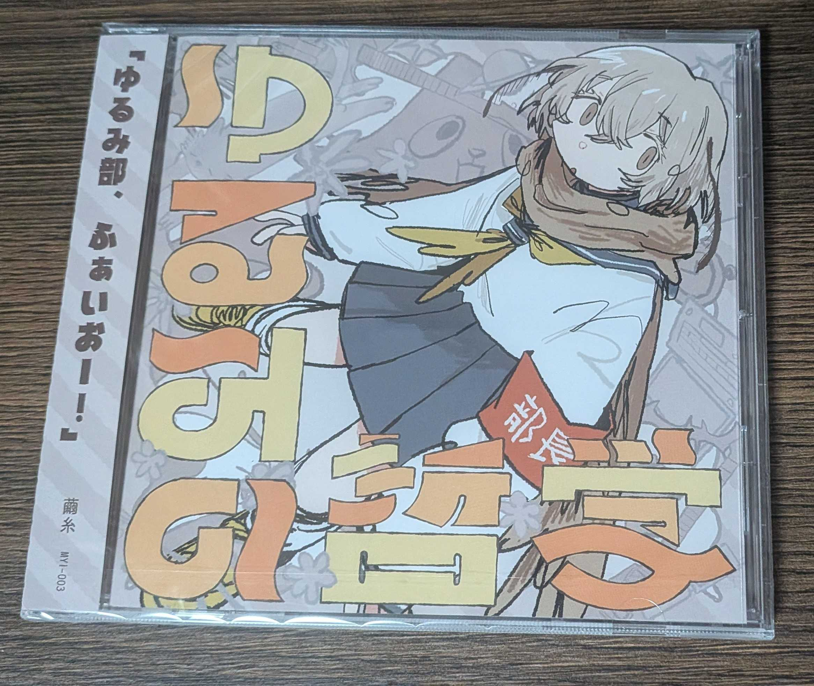

今まで同人即売会などのイベントには参加したことがなかったが、結構前からひっそり応援している人が出展するということで、人生初の同人即売会として [M3](https://www.m3net.jp) に参加してきた。今月は結構疲れていて mp が無かったため、今回は無理せずお目当ての1ブース「[う-35b]空閑環 さん」のみを目的とした。

https://twitter.com/CVTamaki/status/2048060661843075490

こういうイベントでは計画を立てて500円玉と1000円札をしっかり用意していくらしいけど、全くもって無計画だったため事前準備はせず。行く前に財布に500円玉1枚と1000円札が沢山あること（少なくとも目当てのもの以上にはあること）だけは確認した。  
睡眠がオワで寝るか微妙な時間になっていたので、寝ずに行って「全部セット」を買おうかなと思ってたけど、結局眠すぎて仮眠したら昼になっていた。起きてからすぐ家を出たが、向かっている間に CD は売り切れてしまったらしい。  
そんなこんなで13時半くらいに到着。当日入場券を買って入場し、まだ在庫があった「コンセプトブック」「アクリルスタンド」を購入した。  
CD についても聞いてみたところ、後日通販で買えるとのことだったので一安心。寝坊を責める必要はあまりなくなった。サインも書いてもらえた。

|                                      |                                   |
| ------------------------------------ | --------------------------------- |
|  |  |

お金がまだあったので別のブース「[V-09b]繭糸 さん」で CD「ゆるみの哲学」 を買った。タイミングが良かったらしく紙袋ももらえた。

最終的に財布の現金はきれいになくなった。計画したかのようにぴったりだった。  
サッと買った後はサッと帰ったが、一通りブースは歩いて回っていて、色々あって面白そうだった。買ったところ以外では話したり買ったりはしていないので、それはまた元気がある時に行く機会があれば・・・  
こういうことは全く経験がないためちょっと身構えていたが、行ってみたら技術カンファレンスのスポンサーブースエリアとほぼ同じ感じで、あの雰囲気を知っていたため何とかなった。  
コンセプトブックの歌詞の部分はまだ見ていない。最初の出会いは音楽にしたいと思っている。
